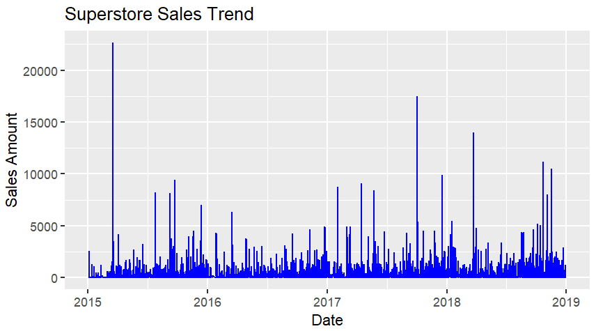

# Superstore Sales Trend Analysis using R  

## Project Overview  
This project analyzes Superstore sales data using R to understand how sales evolve over time. The goal was to clean the data, transform dates correctly, and visualize sales trends through meaningful time-series analysis.  

## Dataset  
- File: Superstore_Sales.csv  
- Rows: 9,800  
- Variables: 19  
- Source: Kaggle Superstore Dataset  

## Tools & Libraries Used  
- RStudio  
- readr → for importing data  
- dplyr → for data manipulation  
- ggplot2 → for data visualization  

## What I did in this project  
1. Loaded the dataset using read_csv()  
2. Inspected column structure using colnames()  
3. Cleaned and converted Order_Date into proper Date format  
4. Aggregated and analyzed sales over time  
5. Created a time-series line chart using ggplot2  

## Final Output — Sales Trend Visualization  

  

Interpretation:  
- The chart shows how total sales changed from 2015 to 2019.  
- We can observe seasonal fluctuations and overall growth patterns.  
- This visualization helps in understanding peak sales periods and long-term trends.  

## Want to see the full R code?  
Sales_Trend_Analysis_R_Notebook.Rmd
This contains all the step-by-step R code used for data cleaning, transformation, and visualization.

## Files in this Repository  
- Superstore_Sales.csv → Raw dataset  
- Sales_Trend_Analysis_R_Notebook.Rmd → Main R analysis code (open this to see everything)  
- Sales_Trend_Analysis_R_Notebook.nb.html → Rendered HTML report  
- sales_trend.png → Final chart preview
